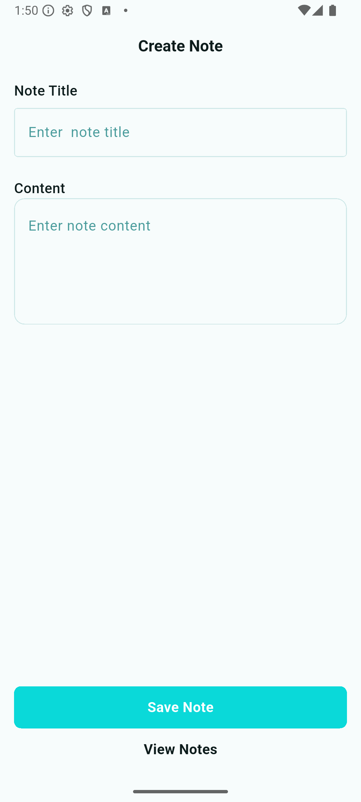
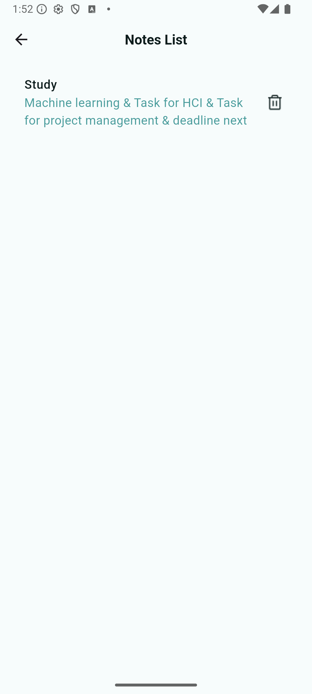
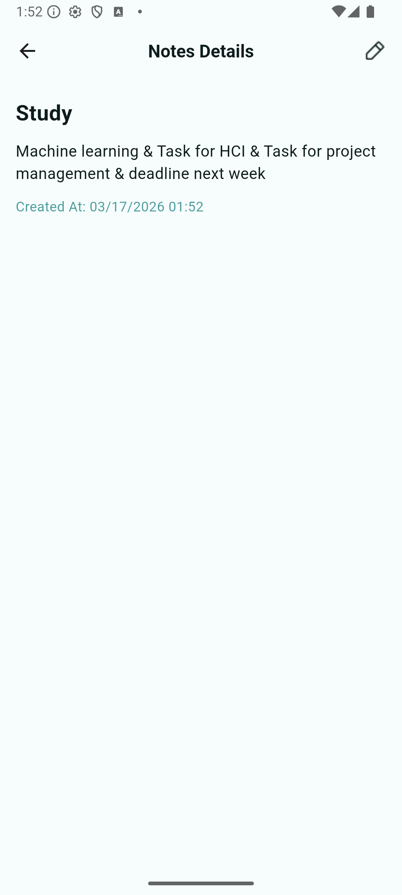
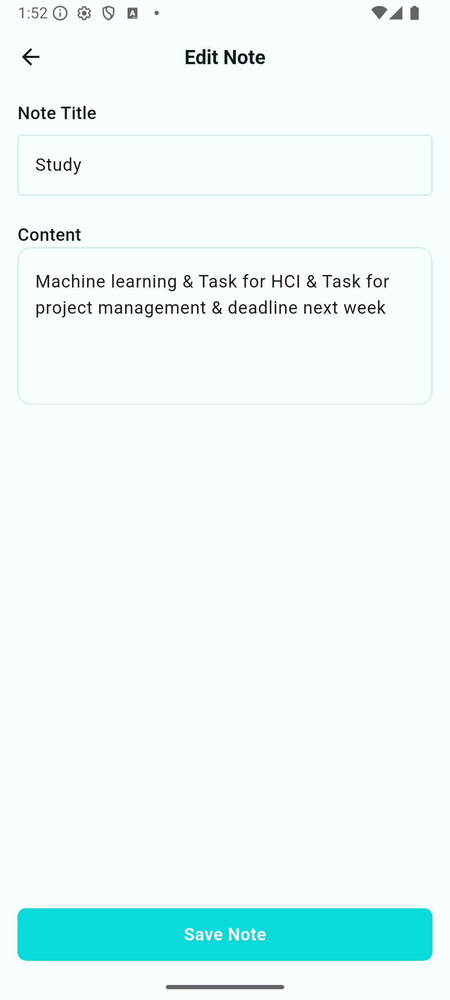

# 📝 Notes App

A Flutter notes application with full CRUD operations powered by Firebase Firestore and Cubit state management.

---

## 📱 Screens

### Create Note


### Notes List


### Note Details


### Edit Note


---

## ✨ Features

- ✅ Create a new note with title and content
- ✅ View all notes in a list
- ✅ View note details with creation date
- ✅ Edit existing notes
- ✅ Delete notes
- ✅ Real-time sync with Firebase Firestore
- ✅ State management with Cubit

---

## 🏗️ Project Structure

```
lib/
├── main.dart
├── firebase_options.dart
├── model/
│   └── notes_model.dart
├── cubit/
│   ├── notes_cubit.dart
│   └── notes_state.dart
└── screens/
    ├── create_note.dart
    ├── notes_list.dart
    ├── note_details.dart
    └── edit_note.dart
```

---

## 🛠️ Tech Stack

| Technology | Usage |
|---|---|
| Flutter | UI Framework |
| Firebase Firestore | Cloud Database |
| flutter_bloc / Cubit | State Management |
| intl | Date Formatting |

---

## 🚀 Getting Started

### 1. Clone the repository
```bash
git clone https://github.com/your-username/notes_app.git
cd notes_app
```

### 2. Install dependencies
```bash
flutter pub get
```

### 3. Configure Firebase
- Create a Firebase project at [console.firebase.google.com](https://console.firebase.google.com)
- Enable Cloud Firestore
- Run FlutterFire CLI to generate `firebase_options.dart`:
```bash
flutterfire configure
```

### 4. Run the app
```bash
flutter run
```

---

## 🗄️ Firestore Structure

```
notes (collection)
└── {documentId}
    ├── title     : String
    ├── content   : String
    └── createdAt : Timestamp
```

---

## 📦 Dependencies

```yaml
dependencies:
  flutter_bloc: ^8.0.0
  firebase_core: ^3.0.0
  cloud_firestore: ^5.0.0
  intl: ^0.19.0
```