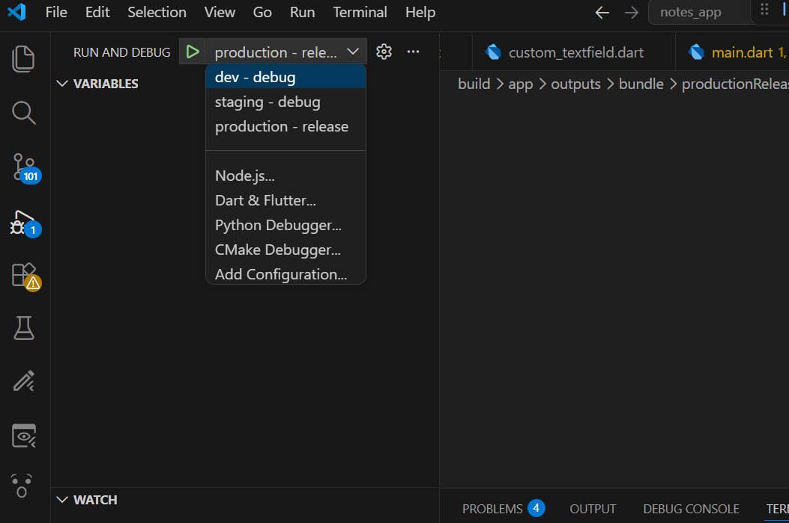
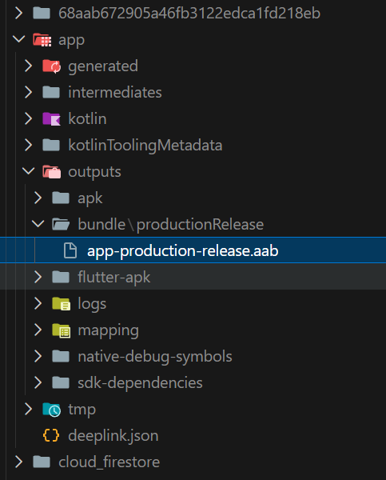

# 📝 Notes App

A Flutter notes application with full CRUD operations powered by Firebase Firestore and Cubit state management — featuring multi-flavor support for Dev, Staging, and Production environments.

---

## 📱 Screens

### Splash Screen — Dev


### Splash Screen — Staging


### Splash Screen — Production


### Create Note


### Notes List


### Note Details


### Edit Note


---

## ✨ Features

- ✅ Create a new note with title and content
- ✅ View all notes in a list
- ✅ View note details with creation date
- ✅ Edit existing notes
- ✅ Delete notes
- ✅ Real-time sync with Firebase Firestore
- ✅ State management with Cubit
- ✅ Multi-flavor support (Dev / Staging / Production)
- ✅ Splash screen showing the running flavor name
- ✅ Per-flavor app name and bundle ID
- ✅ Per-flavor Firebase configuration
- ✅ Release AAB built for Production

---

## 🌍 Flavors

This app supports three flavors configured via [flutter_flavorizr](https://pub.dev/packages/flutter_flavorizr).

| Flavor | App Name | Bundle ID |
|---|---|---|
| dev | Notes Dev App | com.example.notes_app.dev |
| staging | Notes Stage App | com.example.notes_app.staging |
| production | Notes App | com.example.notes_app |

### Run Configurations (VS Code)

Each flavor has a dedicated run configuration in `.vscode/launch.json`:

```json
{
  "version": "0.2.0",
  "configurations": [
    {
      "name": "dev - debug",
      "request": "launch",
      "type": "dart",
      "args": ["--flavor", "dev", "--dart-define=appFlavor=dev"]
    },
    {
      "name": "staging - debug",
      "request": "launch",
      "type": "dart",
      "args": ["--flavor", "staging", "--dart-define=appFlavor=staging"]
    },
    {
      "name": "production - release",
      "request": "launch",
      "type": "dart",
      "args": ["--flavor", "production", "--dart-define=appFlavor=production", "--release"]
    }
  ]
}
```



---

## 📦 Release Build

A signed release AAB was generated for the Production flavor:

```bash
flutter build appbundle --flavor production --dart-define=appFlavor=production
```

Output: `build/app/outputs/bundle/productionRelease/app-production-release.aab`



---

## 🏗️ Project Structure

```
lib/
├── main.dart
├── firebase_options.dart
├── flavors.dart
├── model/
│   └── notes_model.dart
├── cubit/
│   ├── notes_cubit.dart
│   └── notes_state.dart
└── view/
    ├── splash_screen.dart
    ├── login_screen.dart
    ├── create_note.dart
    ├── notes_list.dart
    ├── note_details.dart
    └── edit_note.dart
```

---

## 🛠️ Tech Stack

| Technology | Usage |
|---|---|
| Flutter | UI Framework |
| Firebase Firestore | Cloud Database |
| flutter_bloc / Cubit | State Management |
| flutter_flavorizr | Multi-flavor configuration |
| flutter_launcher_icons | Per-flavor app icons |
| intl | Date Formatting |

---

## 🚀 Getting Started

### 1. Clone the repository
```bash
git clone https://github.com/your-username/notes_app.git
cd notes_app
```

### 2. Install dependencies
```bash
flutter pub get
```

### 3. Configure Firebase
- Create a Firebase project at [console.firebase.google.com](https://console.firebase.google.com)
- Register all three app IDs (dev, staging, production) as Android apps
- Enable Cloud Firestore
- Download the combined `google-services.json` and place it in `android/app/`
- Run FlutterFire CLI to generate `firebase_options.dart`:
```bash
flutterfire configure
```

### 4. Run a flavor
```bash
# Dev
flutter run --flavor dev --dart-define=appFlavor=dev

# Staging
flutter run --flavor staging --dart-define=appFlavor=staging

# Production
flutter run --flavor production --dart-define=appFlavor=production
```

### 5. Build release AAB
```bash
flutter build appbundle --flavor production --dart-define=appFlavor=production
```

---

## 🗄️ Firestore Structure

```
notes (collection)
└── {documentId}
    ├── title     : String
    ├── content   : String
    └── createdAt : Timestamp
```

---

## 📦 Dependencies

```yaml
dependencies:
  flutter_bloc: ^8.0.0
  firebase_core: ^3.0.0
  cloud_firestore: ^5.0.0
  intl: ^0.19.0

dev_dependencies:
  flutter_flavorizr: ^2.2.0
  flutter_launcher_icons: ^0.14.0
```